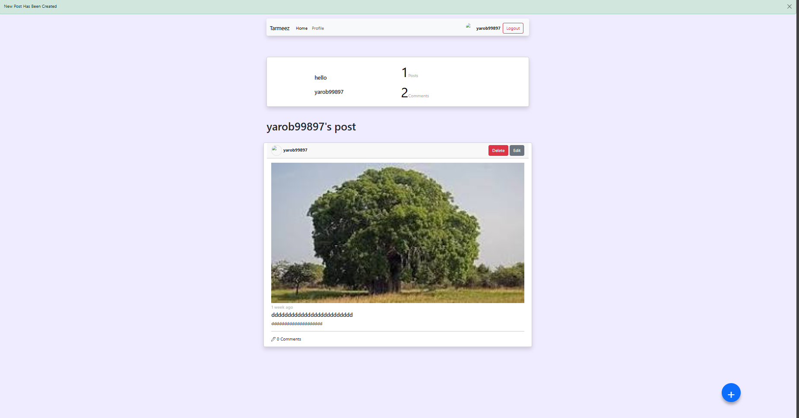
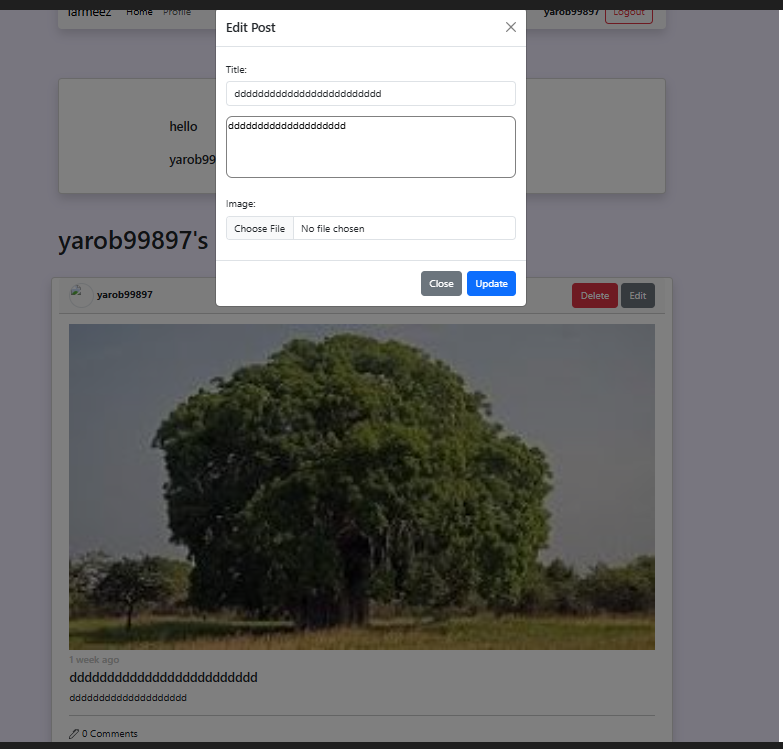
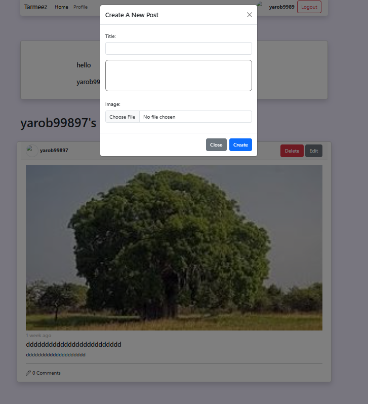
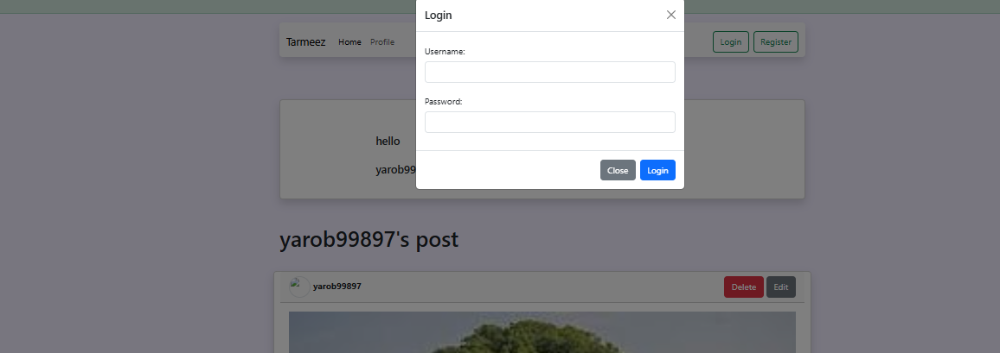

# Social Media & Post Management API Project

An interactive web application designed to integrate with RESTful API services, allowing users to browse posts, authenticate, and dynamically manage posts and comments using JavaScript and modern web technologies.

## 🚀 Features

- **User Authentication:**
  - User Login and Registration.
  - Token and user profile persistence in `localStorage` for automatic authentication.
  - Logout functionality.

- **Posts Management:**
  - Dynamic post feed display, including author details and creation timestamps.
  - Create new posts with support for image uploads and text content.
  - Edit or delete user-owned posts.
  - View detailed post pages along with associated comments.

- **Pagination & Infinite Scroll:**
  - **Pagination:** Structured data retrieval into pages to optimize loading performance and minimize server load.
  - **Infinite Scroll:** Automatic fetching and appending of additional posts as the user scrolls to the bottom of the page for a seamless browsing experience.

- **Comments Management:**
  - Display comments corresponding to each post.
  - Add new comments to posts.

- **Design:**
  - Interactive notification alerts for successful actions or API request errors.
  - Loading spinner indicator during asynchronous API calls.

## 🛠️ Tech Stack

- **HTML5 & CSS3** - Markup structure and styling.
- **Bootstrap 5** - Responsive layout framework, modals, and UI components.
- **JavaScript (ES6+)** - Client-side logic, DOM manipulation, and asynchronous operations.
- **Axios / Fetch API** - HTTP request handling (GET, POST, PUT, DELETE) for API communication.
## Project Preview

## 💻 How to Run

1. Clone the repository:
   bash
   git clone [https://github.com/hebashamsene/API-Project.git](https://github.com/hebashamsene/API-Project.git)
